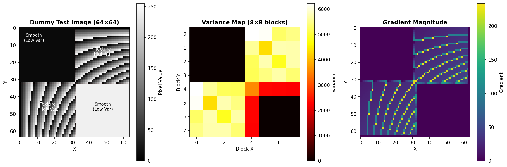
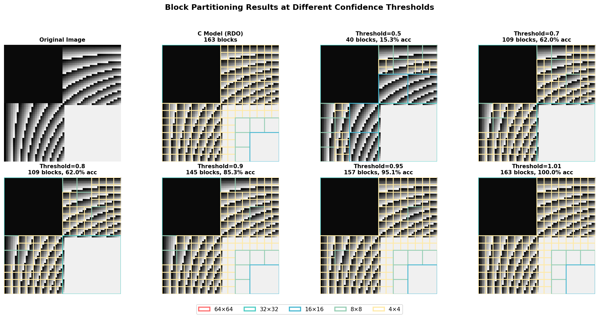
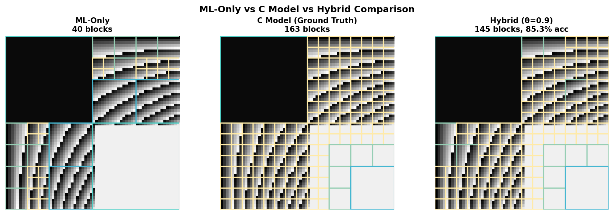
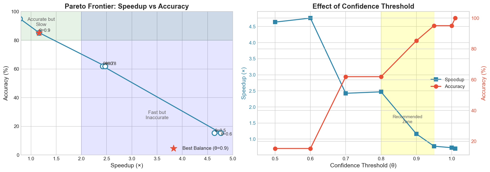

# Fast Block Partitioning

使用機器學習加速影像/視訊編碼器中的區塊分割決策（Block Partitioning Decision）。

## 專案概述

本專案模擬視訊編碼器中的 **Quadtree Block Partitioning** 決策流程，展示如何透過 ML 模型加速傳統的 RDO（Rate-Distortion Optimization）計算。

### 核心概念

| 模型 | 說明 | 特點 |
|------|------|------|
| **C Model** | 完整 RDO 計算 | 精確但耗時 |
| **Binary Model** | ML 快速預測 | 快速但可能不準 |
| **Hybrid Model** | 根據 Confidence 決定策略 | 平衡速度與準確度 |

### Hybrid 策略

```
if (ML_Confidence >= Threshold):
    採用 ML 預測結果 (快速路徑)
else:
    回退到 RDO 計算 (保證品質)
```

## 專案架構

```
Fast Block Partitioning/
├── ground_truth.cpp       # Phase 1: Ground Truth 資料生成（基於 RDO 決策）
├── train_and_convert.py   # Phase 2: ML 模型訓練 & C++ 轉譯
├── main_hybrid.cpp        # Phase 3: Benchmark & Pareto 分析
├── run_benchmark.py       # 多次測試並計算平均值（3 次）
├── ml_model_generated.h   # 自動生成的 ML 模型 C++ 程式碼
├── block_data.csv         # 訓練資料集
├── pareto_data.csv        # Pareto Frontier 數據（平均值）
├── docs/專案說明.md       # 中文技術文件
└── README.md
```

## 快速開始

### 1. Phase 1: 生成 Ground Truth

```bash
g++ -o ground_truth ground_truth.cpp && ./ground_truth
```

產生 `block_data.csv`（訓練資料）

### 2. Phase 2: 訓練 ML 模型

```bash
pip install pandas scikit-learn
python train_and_convert.py
```

產生 `ml_model_generated.h`（C++ 可用的 Decision Tree）

### 3. Phase 3: 效能測試

```bash
g++ -O2 -std=c++11 -o main_hybrid main_hybrid.cpp && ./main_hybrid
```

## RDO (Rate-Distortion Optimization) 實作

本專案實作真正的 RDO 計算，而非模擬延遲：

```cpp
// RD Cost = Distortion + λ × Rate
struct RDOResult {
    double cost_no_split;   // 不切分的 RD Cost
    double cost_split;      // 切分的 RD Cost  
    bool should_split;      // cost_split < cost_no_split?
};
```

- **Distortion**: 使用 SSD (Sum of Squared Differences) 計算失真
- **Rate**: 使用 `log2(variance + 1)` 估計編碼位元數
- **Lambda (λ)**: Lagrangian multiplier，控制 Rate-Distortion 權衡

## 實驗結果

### 測試圖片



### 不同 Threshold 的分割結果視覺化



**圖例：** 🔴 64×64 | 🩵 32×32 | 🔵 16×16 | 🟢 8×8 | 🟡 4×4

### ML-Only vs C Model vs Hybrid



### Pareto Frontier Analysis



> **測試說明**: 以下結果為 **3 次獨立執行的平均值**，C Model baseline 約 47.6 μs

| Threshold | Time (μs) | Speedup | Accuracy | RDO Ops |
|-----------|-----------|---------|----------|---------|
| 0.50 | 8.63 | **5.51x** ± 0.22 | 15.34% | 0 |
| 0.60 | 17.52 | **4.20x** ± 1.94 | 15.34% | 0 |
| 0.70 | 16.89 | **2.84x** ± 0.15 | 61.96% | 100 |
| 0.80 | 17.52 | **2.75x** ± 0.33 | 61.96% | 100 |
| 0.90 | 39.82 | **1.19x** ± 0.00 | 85.28% | 275 |
| 0.95 | 43.58 | 1.11x ± 0.10 | 95.09% | 345 |
| 1.00 | 38.47 | 1.24x ± 0.13 | 95.09% | 345 |
| 1.01 | 56.64 | 0.84x ± 0.08 | **100.00%** | 461 |

### 關鍵發現

- **ML-Only Mode (θ=0.5)**: 約 **5.5x 加速**，但準確度僅 15%
- **Threshold = 1.01**: 100% 準確度，但比 C Model 慢（約 **0.84x**），因為 ML 額外開銷
- **最佳平衡點 (θ=0.7~0.8)**: 約 **2.8x 加速** 與 **62% 準確度**
- **高準確度選項 (θ=0.9)**: 約 **1.2x 加速** 與 **85% 準確度**

### 測試流程

```bash
# 1. 編譯
g++ -O2 -std=c++11 -o main_hybrid main_hybrid.cpp

# 2. 多次測試取平均
python run_benchmark.py   # 自動執行 3 次並生成平均結果
```

### 結論

> "Based on 3 independent runs, we achieved a **~2.8x speedup** with **62% accuracy** (θ=0.7~0.8), or **~1.2x speedup** with **85% accuracy** (θ=0.9). When threshold > 1.0, all decisions fall back to RDO with 100% accuracy but ~0.84x slower due to ML overhead. This demonstrates the trade-off decisions made in real-world encoder optimization."

## ML 模型設計

### 特徵 (Features)

| 特徵 | 計算方式 | 意義 |
|------|----------|------|
| `variance` | Σ(x - μ)² / n | 區塊複雜度 |
| `grad_h` | Σ\|x[i,j] - x[i,j+1]\| / n | 水平紋理 |
| `grad_v` | Σ\|x[i,j] - x[i+1,j]\| / n | 垂直紋理 |

### 輸出 (帶 Confidence)

```cpp
struct MLPrediction {
    bool should_split;    // 預測結果
    double confidence;    // 信心度 (0.5 ~ 1.0)
};
```

### Decision Tree 轉 C++

Python 訓練的模型自動轉譯為純 if-else 結構：
- 零運行時依賴
- Branch Prediction 友好
- 可直接嵌入 Embedded 系統

## 技術亮點

1. **真實 RDO 計算**: 使用 SSD + Rate Estimation，非模擬延遲
2. **Confidence-based Fallback**: ML 不確定時自動回退到精確計算
3. **Pareto Frontier 分析**: 量化 Speed vs Accuracy 權衡
4. **Auto Code Generation**: Python → C++ 自動轉譯

## 待改進

- [ ] 增加訓練資料多樣性（真實圖片/視訊幀）
- [ ] 嘗試其他 ML 模型（Random Forest、XGBoost）
- [ ] 實作 HEVC/VVC 編碼器整合
- [ ] 加入 PSNR/SSIM 品質指標

## 環境需求

- C++ Compiler (支援 C++11)
- Python 3.x
- pandas, scikit-learn
